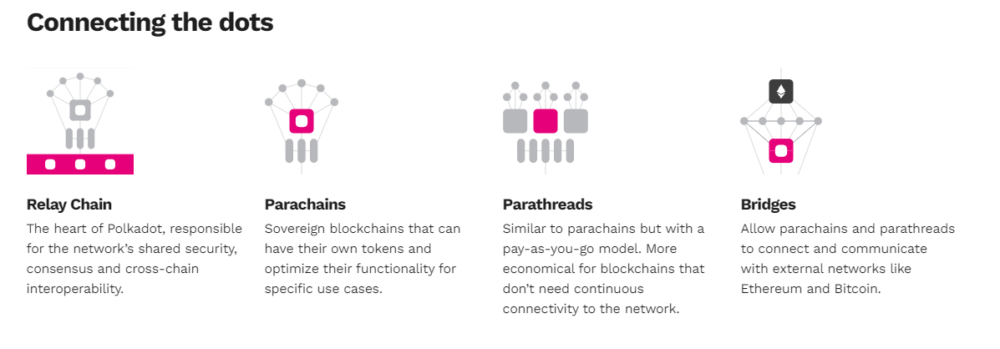
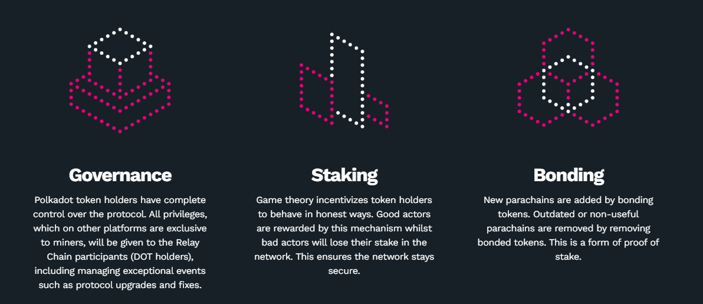

## Le positionnement de Polkadot 

Polkadot est un écosystème blockchain.
Sans entrer dans les détails, cette technologie est née avec Bitcoin. Depuis lors, de nombreuses initiatives ont vu le jour, comme Ethereum par exemple. Beaucoup de projets s’y sont déjà développés et notamment dans le domaine de la finance décentralisée (DeFi) mais aussi des non-fungible token (NFT).

Dans le principe, la technologie blockchain peut contribuer à gérer différemment des **flux financiers**, des **chaînes de valeurs**, de nouveaux modèles de gouvernance… avec plus de **transparence**, de **traçabilité** et d’**implication** des différents acteurs de la chaîne.

De part son ADN et compte tenu de ses spécificités techniques, elle devrait jouer un rôle moteur dans la **décentralisation** du WEB, aujourd’hui essentiellement organisé autour de quelques acteurs majeurs. 

Pour précisément favoriser cette décentralisation des réseaux, il est essentiel de développer des modèles laissant de la **liberté** d’action, les plus ouverts et les plus flexibles possibles. L’important étant alors de les faire travailler ensemble, de les rendre **interopérables**.

Si tel n’est pas le cas, le risque est que des réseaux majeurs prennent des proportions à ce point importantes, qu’il y ait à nouveau un risque de dévers monopolistiques. 

C'est pourquoi Polkadot s’est assigné comme mission de développer et de connecter un environnement de blockchains indépendantes, décentralisées et interopérables en ligne avec une vision d’un internet ouvert, souvent qualifié de WEB 3.0. Ce serait un internet dans lequel la confiance serait placée dans tout le réseau, sa diversité, son organisation, sa gouvernance et favorisant l’échange direct entre ses acteurs.

Incontestablement, le projet est ambitieux. Il est toutefois piloté par une équipe très aguerrie, ayant déjà fait ses preuves avec Ethereum. A sa tête, on retrouve le Docteur Gavin Wood, celui-là même qui fût le co-créateur dudit réseau aux côtés de Vitalik Buterin.

Mais un projet d’une telle ambition ne peut être porté par une seule poignée de personnes. De nombreux talents ont ainsi été regroupés au sein de la fondation WEB3 qui a pour mission d’assurer la promotion et le développement de la communauté Polkadot. Une seconde structure joue un rôle essentiel. Il s’agit de Parity qui a pris en charge le développement des technologies rendant possible le déploiement rapide de Polkadot, sa chaîne principale (relay-chain) et de ses chaînes indépendantes.

Bienvenue dans le monde passionnant de Polkadot. 
 
## L'interopérabilité, une condition au développement du WEB 3.0 

L’interopérabilité est un élément essentiel au cœur de l’écosystème Polkadot. 

Des blockchains telles que Ethereum, Tezos, Cardano, Avalanche... possèdent chacune des caractéristiques propres et très intéressantes, c’est incontestable. Par ailleurs, chaque développeur, utilisateur, est contraint par une relation exclusive à un seul environnement, une seule chaîne. Ces chaînes n’ont pas choisi de développer ensemble mais d’offrir individuellement les meilleurs services et solutions à la communauté, de sorte qu’elle ne sont pas conçues à la base pour interagir entre elles de manière totalement libre et transparente.

Cela doit-il être considéré comme un obstacle majeur ? 

Pensez à Internet pour comprendre ce que sont les enjeux. 

Le web d'aujourd'hui utilise un protocole standard commun pour relier toutes les composantes et acheminer toutes les informations dont il a la charge : TCP/IP. En d'autres termes, le protocole TCP/IP permet à toutes les composantes du web d’échanger sur base d’un langage commun. 

En revanche, les actuelles blockchains, qui ont la volonté de modifier ce même Internet, n’ont pas adopté de protocole commun pour échanger les unes avec les autres. Polkadot change cette donne. 

Polkadot se propose d’agir comme une norme d'interopérabilité entre des blockchains différentes, via le développement d’une chaîne de relais (relay-chain). Par analogie, son apport pourrait être comparé à celui du protocole TCP/IP, adopté pour l'Internet, avec la décentralisation comme règle essentielle supplémentaire. 
 
## Les parachains, une nouvelle approche  

Entrons dans le vif du sujet. Le projet Polkadot est né en 2017 avec le souhait de répondre à des difficultés auxquelles la blockchain était confrontée et essentiellement suivant deux axes, la scalabilité et l’interopérabilité. 

L’idée de base était de développer une technologie permettant à des chaînes indépendantes de s’interconnecter les unes aux autres. Plus de chaînes simultanément signifiait potentiellement plus de scalabilité, pour peu qu’elles puissent travailler ensemble et donc qu’elles soient interopérables. 

Si nous regardions simplement les choses sous un angle visuel, nous pourrions imaginer des centaines de petits points sur une page. Polkadot aurait vocation à les relier et à leur donner une base commune de coopération. 

La technologie sur laquelle repose Polkadot a été prise en charge par une entreprise basée à Berlin, Parity. Le développement faisant son chemin, l’entreprise s’est vite rendue compte que l’énergie déployée à la construction de la relay-chain pouvait aussi être utilisée au déploiement de solutions qui permettraient la création de chaînes indépendantes, rapidement compatibles, tel que cela était escompté. 

C’est ainsi qu’est né Subtrate, un framework développé par Parity, basé sur le savoir-faire acquis de l’élaboration de la relay-chain et qui permet la mise en route rapide d’une blockchain indépendante, facilement  connectable au reste de l’écosystème. Quand elles sont reliées, ces blockchains deviennent parachain. 

Cela étant, à la base, il n’y a pas de barrière technologique à l’entrée pour se connecter à l’environnement Polkadot, Substrate n’étant qu’une possibilité parmi d’autres.  

(source : polkadot.network) 

En revanche, force est de constater que construire un réseau blockchain autonome à partir de zéro est vraiment difficile. Il faut disposer de beaucoup de ressources et de compétences. En utilisant Substrate, comme alternative, chaque entrepreneur dispose d'outils simples et prêts à l'emploi, pour concrétiser rapidement un projet blockchain. 

Selon le créateur de Polkadot, Gavin Wood, il faudrait seulement 15’ pour développer soi-même sa blockchain et fixer les premières bases. C’est une approche compatible avec un objectif de diversité et de décentralisation du web. En effet, pour y parvenir, il est essentiel de réduire les barrières à l’entrée et de faciliter au mieux les participations. 
 
## Les caractéristiques principales de Polkadot 

Nous avons déjà beaucoup insisté sur les aspects de chaînes indépendantes, d’interopérabilité et les enjeux afférents. Les spécificités de Polkadot ne s’arrêtent pas à cela. 

Que retenir en sus et en synthèse : 
- Un environnement dans lequel les transactions sont traitées en parallèle, sur leurs chaînes respectives et donc avec un potentiel de mise à l’échelle illimité ; 
- Un processus de mise à jour intégré au cœur de chaque chaîne qui écarte le risque de voir coexister plusieurs réseaux simultanément en cours de ou après une mise à jour (on appelle cela le risque de fork d’un réseau ) ; 
- Des bases communes et des passerelles pour faciliter les collaborations entre les développeurs et les projets ; 
- Une infrastructure dans laquelle la sécurité est partagée, via la relay-chain, donc potentiellement plus forte ; 
- Un actif digital, le DOT pour permettre une prise de participation active au sein du réseau via le staking, la gouvernance en ligne (plus de détails ci-après) ; 
- Une gouvernance du réseau totalement transparente et organisée sur la blockchain ; 
- Un écosystème ouvert et opensource. 

Arrêtons-nous toutefois sur le jeton Polkadot (DOT), car celui-ci va nous permettre de souligner encore quelques éléments essentiels de cet environnement. 

**Le DOT**

Il s’agit donc de l’actif numérique natif du réseau pour la gouvernance, le staking (mise) et le bonding (cautionnement). Voyons cela en détail. 
 
 
(source : polkadot.network) 

## Bonding - cautionnement 

Le bonding est un concept assez novateur qui mérite que l’on s’y arrête en premier et qui dérive de la nature même de Polkadot. L’environnement étant constitué de multiples chaînes reliées les unes aux autres, pour se parler, elles doivent idéalement être connectées à la relay-chain. Cette connexion se fait par la location d’un emplacement (un slot) à durée limitée. Cette location doit être garantie par une réserve de jetons natifs du réseau. Cette réserve est mise à disposition de la chaîne indépendante (parachain) par tous ceux qui souhaitent soutenir le projet candidat. 

Plus la durée de location est longue, avec un maximum de deux ans, plus l’effort de cautionnement (bonding) est important. Ces opérations de mise à disposition sont appelées des IPO pour « Initial Parachain Offering ». 

Ce mécansime propre à Polkadot doit absolument être distingué de celui des ICO pour « Initial Coin Offering ».  

Dans une ICO, il est procédé à l’échange d’un jeton contre un autre pour aider au développement d’un projet, d’un réseau. Il s’agit d’une forme de financement, de crowdfunding. Bien entendu, rien n’empêche un projet qui se développe dans l’écosystème Polkadot de recourir à un financement via une ICO et d’ensuite s’engager dans une IPO. Ce sont juste des finalités différentes.  

Le bonding nécessite que les jetons (DOT) soient verrouillés plutôt que vendus. A la fin de la période de location du slot, ils sont restitués aux prêteurs, après quoi la parachain peut demander un autre slot ou changer son mode de fonctionnement tout en assurant sa capacité de connexion au réseau. Il existe, en effet, des alternatives aux slots de la relay-chain. 

Enfin, comme les jetons ne quittent pas le réseau, le mécanisme des IPO contribue potentiellement à l’augmentation de sa valeur. Comme ils sont verrouillés pour un temps, un effet de rareté est possible. 
 
## Staking – la mise 

(source : polkadot.network) 

Polkadot sécurise et connecte de nombreuses parachain par le bief de sa relay-chain. Pour ce faire, il a fallu y mettre en place un solide mécanisme de consensus qui assure le bon fonctionnement de cette relay chain : comment les blocs sont-ils produits, comment les informations sont-elles vérifiées… 

Pour que ce mécanisme fonctionne, la communauté, les détenteurs de jetons (DOT) doivent y prendre part en les mettant en jeu (staking). 

La sécurité, les transactions du réseau sont assurées par les validateurs. Dans chacune de leurs interventions, ils mettent en jeu des jetons mis à disposition par leurs détenteurs, qui jouent alors le rôle de nominateurs. Cette mise en jeu garantit la crédibilité de leur intervention. 

Nul ne souhaite perdre sa mise en se rendant coupable de mauvais comportements  et c’est cela qui assure un bon niveau de confiance au sein du réseau. 

Les validateurs, comme les nominateurs sont rémunérés pour le rôle joué et leur contribution à la sécurité du tout. 

## Gouvernance 

In fine, ce sont les détenteurs de jetons qui contrôlent le réseau Polkadot. 

Au travers d’appels aux votes publics, ils prennent directement certaines décisions qui concerne l’organisation du réseau, son développement technique, ses orientations stratégiques. 

On appelle cela une gouvernance décentralisée et transparente. Ces nouveaux modes organisationnels sont rendus possibles et efficaces grâce à l’utilisation de la technologie blockchain qui rend publiques toutes les transactions et les interventions des parties prenantes à la gouvernance. Ceci est évidemment très différent de tout ce que nous avons connu jusqu’à présent avec les entreprises classiques qui convoquent plus rarement leurs actionnaires pour des assemblées générales. Ici, la gouvernance est exercée et partagée en permanence, 7/7 jours. 

Pour y prendre part, les utilisateurs doivent, à nouveau, détenir des jetons du réseau (DOT), qu’ils vont verrouiller plus ou moins longtemps pour soutenir la décision de leur choix. Ces mêmes jetons sont libérés à la fin du vote. 

Enfin, pour éviter que les votes ne soient l’apanage seul des plus gros détenteurs de DOT, la communauté a mis en place un mécanisme spécifique d’engagement temporel. Il est possible de contrebalancer le fait de détenir moins de DOT en les bloquant sur une plus longue période, ce qui aura pour conséquence de donner plus de poids au vote. 

## Quelques mots à propos de Kusama 

Kusama est un réseau qui fait partie de l’écosystème Polkadot, avec une relay-chain et un jeton (KSM) qui lui sont propre. 

Il dispose de la même technologie, du même suivi, du même potentiel que Polkadot. 

Mais qu’est-ce qui les distingue alors ? 

Kusama a été conçu avec plus de flexibilité pour permettre l’implémentation de cycles plus rapides pour le développement, le bonding, le staking, l’allocation de slots sur la relay-chain… 

Il doit permettre de déployer des projets potentiellement plus mobiles dans un environnement moins coûteux, là où Polkadot sera plus organisé autour de périodes longues, avec un objectif de stabilité. 
 
Polkadot est un pôle d’attraction pour les projets blockchain 

L’engouement pour Polkadot ne cesse de croître au fur et à mesure que sa communauté se développe. De plus en plus de projets  s’y grèvent et s’y développent, et ce, pour 3 raisons majeures : 

1. La relay-chain offre le service d’une sécurité partagée sans pour autant faire entrave à la liberté et l’autonomie des projets portés par les parachain. 

2. Dans un environnement complexe, en constante évolution, les projets peuvent se concentrer sur leur modèle, leurs services, leur propre spécialisation. 

3. Enfin, la connexion à la relay-chain permet aux blockchains de faire passer des messages entre les réseaux de manière transparente, offrant ainsi une véritable interopérabilité entre ceux-ci. Pour les développeurs, ceci est particulièrement attractif car la collaboration va permettre des renforcements mutuels. 

Pour plus d’informations : 
https://polkadot.network/  /  https://web3.foundation/  /  https://www.parity.io/ 
https://substrate.dev/ 
